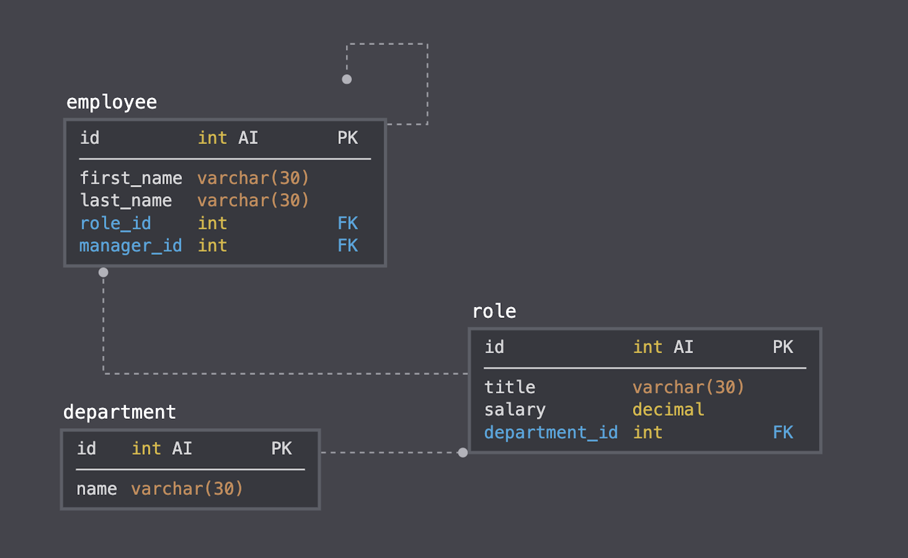

# mysql-employee-tracker-hw

# title

MYSQL Employee Tracker Project

# description

Architect and build a solution for managing a company's employees using node, inquirer, and MySQL. Build a command-line application that at a minimum allows the user to:

* Add departments, roles, employees

* View departments, roles, employees

* Update employee roles

# install

* npm init -y

* npm i inquirer 

* npm i mysql 

 * npm i console.table 

# run

* node app.js

# built using

Javascript, jQuery, Node.js, MySQL, Inquirer

# schema

# author

Alexandra Eesley 2020
